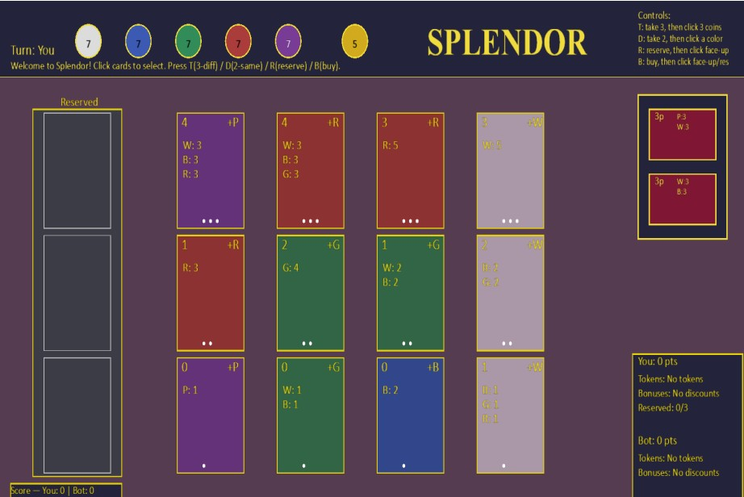
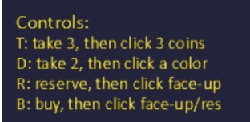
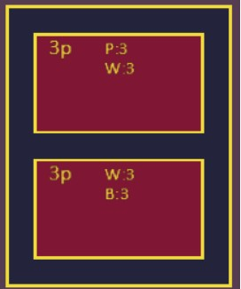
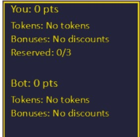
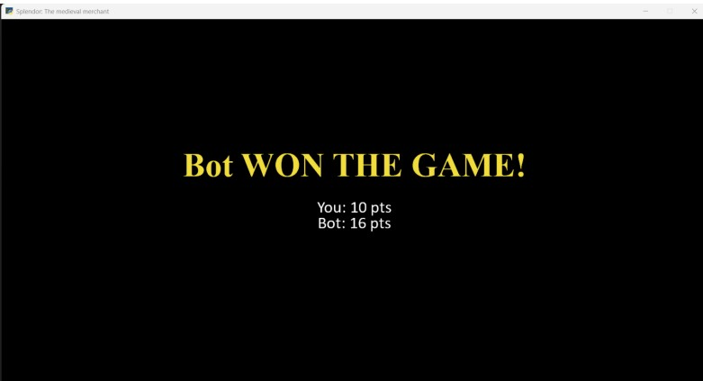

## Splendor Game Using Python Arcade

## Problem Statement

The project aims to bring the board game **Splendor** to life in Python using the Arcade library, creating a smooth and visually engaging way to play on screen. The game will follow the official rules closely, handling tokens, cards, nobles, and turns just like the real board game.

It is built to support multiple players, with an added option to include a robot player powered by AI. This robot won’t just pick random moves; it will play strategically, sometimes using a greedy approach to grab the best immediate option, and at other times relying on a UCT-based method to balance between trying new moves and sticking with strong strategies. Together, these give the AI a mix of quick, straightforward decisions and deeper, more thoughtful plays.

With a working game engine, clear visuals, and the mix of human and AI players, the digital version aims to capture the fun and competitiveness of Splendor in a modern, interactive format.

---

## Detailed Rules

### The Setup

* **Token piles (gems):**
  Five colored gem tokens — diamond (white), sapphire (blue), emerald (green), ruby (red), and onyx (black) — plus gold tokens (wildcards, often called jokers).
  Gold tokens come only from reserving cards.

* **Development cards:**
  Three decks:

  * Level I — cheapest
  * Level II — medium cost
  * Level III — most expensive

  Each card lists:

  * **Cost:** How many tokens of each color are required to buy it
  * **Bonus:** A permanent one-gem discount of a specific color (applies to future purchases)
  * **Prestige points:** 0–5 points that count toward winning

* **Nobles:**
  Face-up tiles showing a set of bonus color requirements. When a player has the required permanent bonuses, they gain the noble and its points.

* **Player boards:**
  Each player keeps tokens, purchased cards (bonuses), reserved cards, and prestige points.

#### Initial Setup Steps

1. Shuffle each of the three development decks separately. Deal 4 face-up cards from each deck in a row.
2. Shuffle nobles and deal face-up nobles equal to the number of players + 1.
3. Place token piles within reach. (Official token counts depend on player count; for software, standard counts or a sufficiently large supply for 2–4 players may be used.)
4. Each player starts with zero tokens, zero bonuses, zero reserved cards, and zero prestige.

---

## Player Turn — Choose Exactly One Action

### 1) Take Tokens

* **Option A:** Take 3 tokens of three different colors (gold is not allowed). Only colors with at least one available token may be taken.
* **Option B:** Take 2 tokens of the same color, but only if there are at least 4 tokens of that color left in the bank at the moment of taking them.

After taking tokens:

* If a player has more than the maximum hand limit (usually 10 tokens), they must immediately return tokens to the bank until they have 10.

**Notes:**

* Gold tokens cannot be taken using the “take tokens” action.
* Actions cannot be split (e.g., taking 2 of one color and 1 of another).

---

### 2) Reserve a Card

* Reserve one face-up card (from the 12 visible cards) or draw a random top card from any deck (face-down).
* When reserving, if gold tokens are available, take 1 gold token immediately.
* Reserved cards are private to the player and kept face-down.
* A player may have at most 3 reserved cards.

**Reasons to reserve:**

* Guarantee the right to buy a card later
* Deny a card to an opponent
* Obtain a gold token to assist purchases

---

### 3) Buy a Development Card

* Buy a face-up card, a previously reserved card, or a card reserved from the deck.

**Payment process:**

* Effective cost per color:
  `max(0, card.cost[color] − player.bonuses[color])`
* Pay costs using tokens; gold tokens may be used as wildcards.
* Return all spent tokens (including gold) to the bank.

**After purchase:**

* Place the card into the player’s tableau
* Increase the permanent bonus of the card’s color by 1
* Add the card’s prestige points to the player’s score
* Replace face-up cards if possible

---

## Nobles (Special Score Bonuses)

* At the end of a player’s turn, check noble requirements.
* If satisfied, the player automatically receives the noble and its prestige points.
* If multiple nobles apply, the player may choose which to receive (subject to implementation rules).
* Claimed nobles are removed from the display.

---

## End-of-Game and Scoring

* The game ends when a player reaches at least 15 prestige points at the end of a turn.
* The round is completed so all players have equal turns.
* The winner is the player with the highest prestige points.

**Tie-breakers:**

1. Fewest purchased development cards
2. Earlier turn order in the final round

---

## Important Mechanics and Edge Cases

* Gold tokens are obtained only via reserving cards.
* Empty token piles cannot be drawn from.
* Empty decks leave display slots empty.
* Token returns are chosen by the player.
* Maximum of 3 reserved cards is strictly enforced.
* Bonuses reduce cost but are not spendable tokens.
* Multiple noble claims must be clearly defined and documented.

---

## Examples

### Example 1 — Buying with Bonuses

* Card cost: emerald 3, ruby 2
* Player bonuses: emerald 2, ruby 0
* Player tokens: emerald 1, ruby 2

**Effective cost:** emerald 1, ruby 2 → Purchase succeeds.

---

### Example 2 — Using Gold Tokens

* Card cost: diamond 2, sapphire 2
* Player bonuses: diamond 0, sapphire 1
* Player tokens: diamond 1, sapphire 0, gold 2

Gold tokens act as wildcards to complete the purchase.

---

## AI Algorithms Used

The artificial intelligence system implemented in this game is a **rule-based heuristic decision-making model** designed to simulate rational, goal-oriented behavior within a strategic resource management environment.

It does not employ deep learning or search-based planning, instead using structured logic inspired by classical AI decision frameworks such as greedy optimization, constraint satisfaction, and goal-driven heuristics. This design ensures gameplay that is both competitive and interpretable.

---

## AI Architecture Overview

The AI operates through a multi-tier decision-making architecture following the cycle:
**Perception → Evaluation → Action**

### Tier 1: Opportunistic Purchase Strategy

The AI evaluates all visible cards, filters affordable options, and selects the card with the highest prestige value using greedy maximization.

### Tier 2: Resource Optimization and Token Acquisition

When purchases are not possible, the AI collects strategically useful tokens to improve future purchasing capability, falling back to redundancy rules if needed.

### Tier 3: Constraint Enforcement and State Validation

The AI enforces hand limits, maintains bank consistency, and validates noble acquisition and end-game conditions.

---

## Computational Complexity

* Card evaluation per turn: **O(n)**
* Token collection operations: **O(k)** (small constant)

This enables real-time gameplay without search trees.

---

## Strengths of the Approach

* Explainable AI decisions
* Low computational overhead
* Strategic adaptability
* Strict rule compliance

---

## Game Screenshots

### Game Opening Screen

### Keyboard Controls

### Reserved Deck 

### Nobles Deck

### Points and Actions Tracker

### Token Bank and Status Bar

### Game Over Screen

---

## Learning Outcomes

* Practical experience in Python game development using the Arcade library
* GUI design with interactive and adaptive components
* Rule-based heuristic AI implementation
* Object-oriented programming and state management
* Enhanced debugging, optimization, and problem-solving skills

---
## Authors

* Madhangi Karimanal 
* Nithyasree K 
